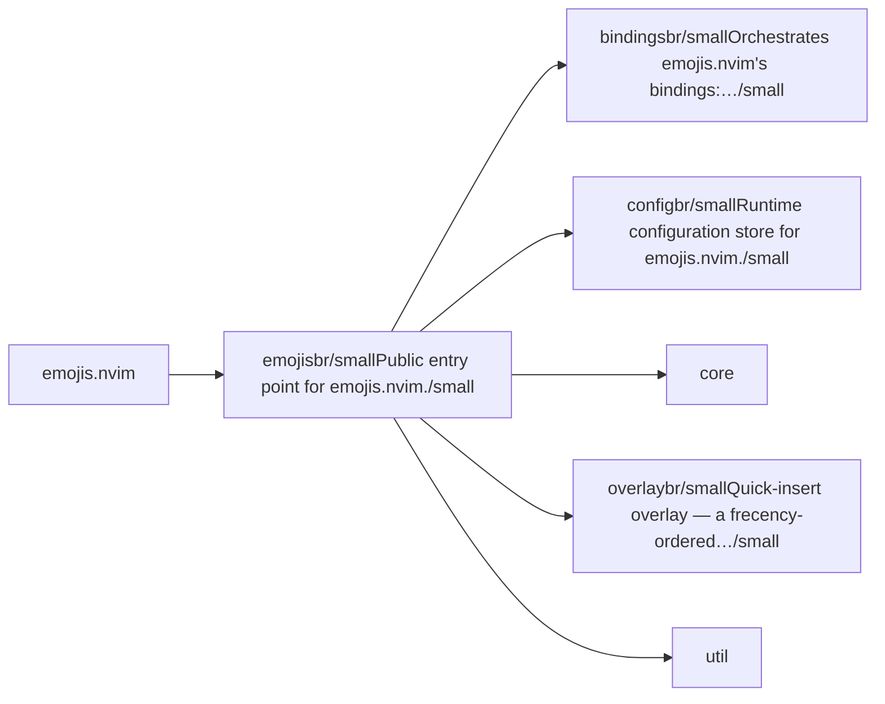
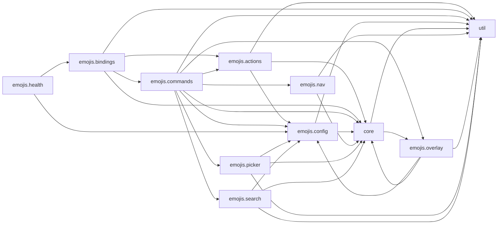

# emojis.nvim — module map

> **Generated** by `documentation`. Do not edit by hand — run `:DocMap`
> (or `nvim --headless -l scripts/gen_map.lua`) to regenerate.

**4 modules** · 3 namespaces · 20 helper files

The [interactive map](index.html) has filtering, full descriptions and
source links; this page is the version the code host renders directly.

## Namespaces

## Dependencies

Which parts of the tree require which, rolled up to the second level.
The [interactive map](index.html)'s **Deps** view has this per module,
in both directions, with load-time and lazy requires told apart.

## Modules

| Module | Description | Fns | Docs |
|---|---|---|---|
| `emojis` | Public entry point for emojis.nvim. | 11 | [src](../../lua/emojis/init.lua) |
| &nbsp;&nbsp;`emojis.bindings` | Orchestrates emojis.nvim's bindings: usrcmds, keymaps, autocmds. | 1 | [src](../../lua/emojis/bindings/init.lua) |
| &nbsp;&nbsp;`emojis.config` | Runtime configuration store for emojis.nvim. | 5 | [src](../../lua/emojis/config/init.lua) |
| &nbsp;&nbsp;`core` |  |  |  |
| &nbsp;&nbsp;`emojis.overlay` | Quick-insert overlay — a frecency-ordered grid of the emojis a developer reaches for most. | 13 | [src](../../lua/emojis/overlay/init.lua) |
| &nbsp;&nbsp;`util` |  |  |  |

## Drift

0 errors · 1 warnings · 6 info

| Severity | Check | Message |
|---|---|---|
| warn | `doc-references-missing` | docs/BINDINGS.md:22 references 'emojis.list', but emojis has no 'list' |

6 informational findings

| Check | Message |
|---|---|
| `missing-readme` | lua/emojis has no README.md |
| `missing-readme` | lua/emojis/bindings has no README.md |
| `missing-readme` | lua/emojis/config has no README.md |
| `missing-readme` | lua/emojis/overlay has no README.md |
| `unreferenced-module` | emojis.@types is required by no other file in the tree |
| `unreferenced-module` | emojis.health is required by no other file in the tree |

